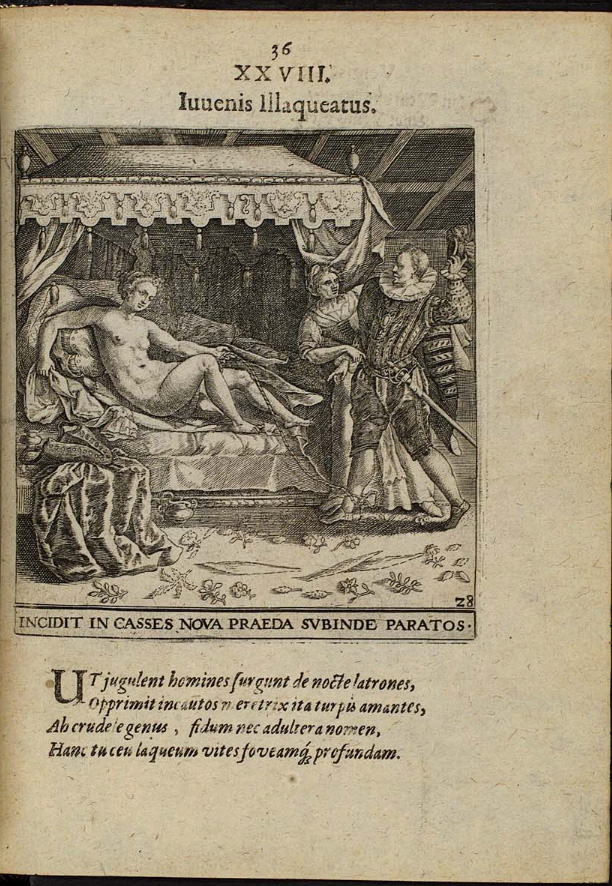

# Modisches Powerplay 
## Feminismus und Nationalismus
---

Diese Datenvisualisierung handelt von Isabel de Borbón, ihrem Kleid und der spanischen Krone.
Die Kleidung der zukünftigen Königin ist mit großer Intention gewählt und bedeutungsvoll in ihrer Symbolik.

Das Portrait zeigt die Mode der Zeit, die geopolitische Positionierung, den Wohlstand, die Rolle der Frau und noch vieles mehr.

---

## Machtfestigung 

Das Gemälde entstand 1620 und damit ein Jahr bevor Isabel de Borbón zur Königin von Spanien gekrönt wurde.
Zum Zeitpunkt der Entstehung ist sie Frau von Philipp IV., dessen Bruder 1621 stirbt und damit die beiden zu Nachfolgern macht.

Gemalt von Rodrigo de Villandrando

circa 1620

Maße: 201 cm x 115 cm

heute hängt es im Museo del Prado

---

## Entstehung des Bildes

### Rodrigo de Villandrando
geboren in Madrid 1588
gestorben in Madrid 1622

Titel des ,,Gerichtsvollzieher”

Er war Maler des Spanischen Hofs von 1608 bis 1622.

---

## Die Mode en detail

Die Mode der Zeit ist starker Bedeutung für Macht, Familiäre Allianzen, Wohlstand und Geopolitischer Positionierung.

---

## Halskrause
Isabel de Borbón trägt eine Halskrause aus Spitze mit floralen Details

Krausen aus Spitze wurden 1623 verboten, durch ein Luxusgesetz. Darauf folgten die Golilla Kragen, gehärtete Kragen die mehrmals getragen werden konnten.

Isabel Clara Eugenia
Juan Pantoja de la Cruz, 1598 - 1599
(1553–1608)
Oil on canvas
14,7 × 11,4 cm

Doña Ana de Velasco y Girón, 1603
Juan Pantoja de la Cruz (Spanish, 1553-1608).
Collection of Alicia Koplowitz
103 x 82 cm

Busteportret van Isabella Clara Eugenia, Crispijn van de Passe (I), 1596
gravure, 112 × 89 cm

Margaret of Austria, Queen Consort of Philip III of Spain (1584-1611) c.1605
Juan Pantoja de la Cruz (C. 1553-1608)
Oil on canvas | 204.6 x 121.2 cm | RCIN 404970

---

## Taschentuch und Manschette

### Manschette

Die Manschette war und ist häufig eine Art Gegenstück zum Kragen. Sie ergänzen sich oft in Stil und Form oder stehen in einem gewissen Verhältnis zueinander.

manchette ‚Ärmelchen'

### Spitze

Spitze >Garngeflecht< bzw.
>in Zacken auslaufende Borte<
Diese Spitzenform wurde zuerst in Venedig gepflegt (Point de Venise) und bald in Frankreich nachgeahmt (Point de France, Point de Neige, Rose Point)

---

# Women’s Fashions and Politics in Seventeenth-Century Spain: The Rise and Fall of the Guardainfante
Author: Amanda Wunder

---

# Guardainfanta
Die größte Symbolische Wirkung nach außen hat das Kleid von Isabel de Borbón
Es handelt sich um eine sogenannte Guardainfanta.

---

# Farbe
Die Farben des Kleids sind von äußerst großer Bedeutung. Es sind die klassichen Farben des Portugisischen Hofs.
Denn Isabel de Borbón ist zum Zeitpunkt der Entstehung noch nicht Königin von Portugal, wird es aber bald werden.
Portugal ist zu diesem Zeitpunkt Teil der Spanischen Krone.

---

# Die Konstruktion
Die Guardainfanta beruht auf einem Reifrock, genannt Farthingale. 
Der Farthingale wird aus Holz, Walknochen, später auch Blech zu einer Konstruktion geformt. Ringförmig um die Trägerin. Anschließend wird er an der Hüfte befestigt.
Darüber kommt meist ein Unterrock und dann die Guardainfanta.

Speziell an der Spansiche Variation des Fartingales ist die ovale Form. 
Die Fartingales von Frankreich und England waren meist rund.

Isabel de Borbón
Diego Velazquez. Queen Mariana of Austria, ca. 1652. 
Museo Nacional del Prado, Madrid.

### Tontillo

Eine besonders breite Variante war in Mode von 1660 bis 1700

Juan Carreño de Miranda. Doña Inés de Zúñiga, Condesa de Monterrey.
Hacia 1660-1670. Museo Lázaro Galdiano. Madrid.

---

# Kritik an der Mode

María de la Encarnacion muss vor Gericht

Guardainfante seien zu groß, zu unbequem

Verheiratete Frauen sollten sich für ihren
Mann kleiden, damit er der Frau treu bleibt

Guardainfante würden zu viel Aufmerksamkeit
erzeugen in den Straßen

---

# Aufruhr in Madrid

Junge Männer zogen durch Madrid und beleidigten Frauen, die einen Guardainfante trugen.
Sie wurden Übergriffig und Gewaltsam gegenüber Frauen

### „Frauen würden öffentliche Unruhe verursachen wenn sie so breit rumlaufen”

### “Now women do not fit in the world”
Ibid., 148 (line 60): “ya no caben las hembras dentro del mundo.”

According to those sixteenthcentury authors, the ideal woman was silent and agreeable. She worked hard inside
the home to fulfill her domestic chores, and she avoided going out in public
whenever possible. She dressed cleanly but modestly and shunned cosmetics and
opulent attire, although a married woman might have to make up her face and
dress more lavishly if this was what her husband wanted.
39
Vives, 94–109; Le on, 302–28.

---

# Mord an zwei MännernF für ihr Verhalten gegenüber Frauen
## 1636 in Madrid

---

# Verbote
König Philipp IV. muss auf die Situation in Madrid reagieren. Eine Nonne, mit welcher er in regem Austausch steht, empfiehlt ihm das Kleid zu verbieten und damit das Volk zu beruhigen.
Das Gesetz folgt am 13 April 1639. Mit Trommeln und Trompeten wird das Gesetz verkündet.

King Philipp IV. Sumptuary law banning the guardainfante for all women
except for prostitutes. Madrid, 1639. Historical and Special Collections,
Harvard Law School Library.

Frauen die gegen das Gesetz verstoßen würden, würde eine Geldstrafe bekommen und das Kleid konfisziert.

Die neuen Gesetze suggestieren, es sei unmöglich die
Frauen vom Tragen des Guardainfante zu stoppen.

Kleider wurden an der Fassade des Hof-Gefängnisses
aufgehangen.

Doch niemand beachtete das Gesetz, nicht einmal die
König Isabel de Borbón selbst.

Die Unfähigkeit des Königs ein so banales Gesetz durch zu setzen, wird kritisiert und zeigt seine Schwäche als Herrscher auf.

---

# Sexwork
Das neue Gesetz erlaubt nur Sexworkerinnen
die Guardainfante zu tragen.

Johann Theodor de Bry
Proscenium vitæ humanæ siue Emblematvm Secvlarivm, Ivcvndissima, & artificiosissima varietate Vitæ Hvmanæ & seculi huius deprauati mores, ac studia peruersissima
Franckfurt : Fitzer, 1627

Damit würden sie erkennbar sein und die
Öffentlichkeit könne ihr treiben überwachen.
Da jeder Hausbesuch auffällig ist.

Klare Abgrenzung von der Gesellschaft und
Stigmatisierung von Sexworkenden. 

---

# Schwangerschaft

## „Frauen verstecken ihre Schwangerschaft”
Diese Rufe werden immer lauter in der Spanischen Gesellschaft.

Kein einziger Fall ist bekannt, von einer versteckten
Schwangerschaft unter dem Kleid.

Frauen wird vorgeworfen uneheliche Kinder zu verstecken.

Das Kleid sei demnach unehrlich und gefährlich.

---
# Fruchtbarkeit
Das Kleid stand sowohl für uneheliche Schwangerschaft, als auch für Fruchtbarkeit.
Die spanische Krone zeigt ihre Prinzessinnen gerne in Guardainfanta, um die Fährigkeit einen gesunden Nachfahren/Herrscher/Thronfolger zu gebähren, zu zeigen.

The portrait of the infanta Margarita (ca. 1665)
Ignacio Ruiz de la Iglesia
Oliv an Santaliestra, 2011, 843–45.
Oil on canvas
126 x 97 cm

Tochter von König Philipp IV.
Nach ihrer Heirat in den Wiener Hof

“a thirteen-year-old Margarita was portrayed wearing
a guardainfante beneath an orange skirt and pointing
toward her belly in a gesture that promises the princess’s
potential for bearing future emperors.”

---

# Empowerment
Unklar bleibt bis heute, ob die Frauen die
Kleider für sich trugen, oder für die Männer.
Dabei sind eine Vielzahl an Einschränkungen zu beachten.

Die Guardainfanta schafft den Frauen mehr Raum in der Öffentlichkeit einzunehmen und gehört zu werden.

Die Kleider sorgten für Aufmerksamkeit, im guten wie im schlechten.

Die Trägerinnen der Kleider wurden in ihrer Bewegungsfreiheit stark eingeschränkt. Sie passten teilweise nicht mehr durch die Türen des Hofes.

Frauen konnten mehr Raum in der Gesellschaft
einnehmen, wurden wichtiger im öffentlichen Diskurs.

Jede Körperform konnte verdeckt und zum
Schönheitsstandard der Zeit geformt werden. Sie schützten den Körper vor Blicken und schafften eine Hülle/Maske.

---

# Nationalismus
Katharina von Braganza heiratet in die britische Krone. Auf dem Weg zur Hochzeit steigt sie auf ein Schiff der Spanischen Krone in einer Guardainfanta und steigt einige Tage später von Bord wieder in einer Guardainfanta. Die britische Öffentlichkeit ist empört. Diese Zuschaustellung spanischer Herkunft, Katholischen Glaubens und Allianz zur Spanischen Krone lässt sie in Ungnade 

Catherine of Braganza
by or after Dirck Stoop
oil on canvas, circa 1660-1661
48 1/2 in. x 39 1/2 in. (1232 mm x 1003 mm)

The guardainfante was front and center in the marriages of three
Iberian princesses in the 1660s: the infanta Mar ı a Teresa’s 1660 marriage to
Louis XIV of France, the wedding of the Portuguese princess Catherine of
Braganza to Charles II of England in 1662, and the infanta Margarita’s union
with the Holy Roman emperor Leopold I in 1666.

### Catherine of Braganza’s (...) the guardainfante marked her as foreign, Catholic, and an ally of their Spanish enemy.

Der französische Diplomat Antoine de Grammont reist nach Spanien um die Hochzeit zwischen María Teresa und König Louis XIV zu arrangieren schreibt er es sei unmöglich den Körper zu beurteilen, da sie eine große Guardainfanta trug.

The iconic guardainfante, as worn by Queen Mariana of Austria, second wife of Philipp
IV. Diego Velazquez. Queen Mariana of Austria, ca. 1652. Museo Nacional del Prado, Madrid.

---

# Geopolitik

## Auftreten
Die Guardainfante markiert einen klaren Unterschied zwischen Unterstützern der französischen und spanischen Krone. Besonders weil Fartingales in Frankreich aus der Mode gekommen waren.
Das Kleid wurden auf allen wichtigen Anlässen getragen und zeigt für Betrachtende direkt die Allianz zur Spanischen Krone.
Prinzessinen und Königinnen der Spanischen Krone trugen das Kleid auch im Ausland.

Las Meninas
Diego Velázquez, 1656
Öl auf Leinwand
318 × 276 cm
Museo del Prado

The hoopskirt that seemed so “monstrous” in Paris and London was viewed
much more favorably in Vienna, a Spanish ally with a common Habsburg bond,
which was the destination of the infanta Margarita (1651–73). The daughter of
Philipp IV. and Mariana of Austria, Margarita is best known as the little girl at
the center of Vel azquez’s Las Meninas (1656) ), which features the
five-year-old infanta wearing a guardainfante almost as wide as she is tall.

See Bandr es Oto, 210–11, on children’s clothing,
and on the infanta Margarita’s attire in Las Meninas, 358–59.

## Positionierung
In der Stadt Genua, tragen die Frauen ihre Guardainfante, zum Ärgernis der französischen Besatzer.
Eigentlich gehört Genua zu Spanien, wurde allerdings von Frankreich anektiert.

---

# Guardainfanta 
## Ein spanisches Kleid sorgt für Aufsehen im In- und Ausland

Zusammenfassend kann gesagt werden; dass das Kleid im 17. Jahrhundert eine wichtige Rolle in Europa spielte.
In Spanien und im Höfischen Leben von ganz Europa war das Kleid eine Symbolisches Statement mit vielen Dimensionen.
Dabei schwankt die Konnotation des Kleids zwischen positiven und negativen Assoziationen.

Ein Kleid das die Sexworkerinnen kontrollieren soll, Schwangerschaften verdecken würde aber auch Fruchtbarkeit untermalt.

---

# Credits
Diese Visualisierung wurde kuratiert und gestaltet von David Lamb

Kurs: Argumentation im Bild und über das Bild: Europäische Bild- und Kleidergeschichte visualisiert SoSe 2024

Betreuung: Dr. Sabine de Günther

https://uclab.fh-potsdam.de/bildargument/

---

 
 

[Contact](mailto:marian.doerk@fh-potsdam.de,philipp.proff@gmx.de?subject=Syllabus%20Site) · [Imprint](https://www.fh-potsdam.de/impressum) · *This is a [Syllabus Site](https://infovis.fh-potsdam.de/syllabus-site/)*
