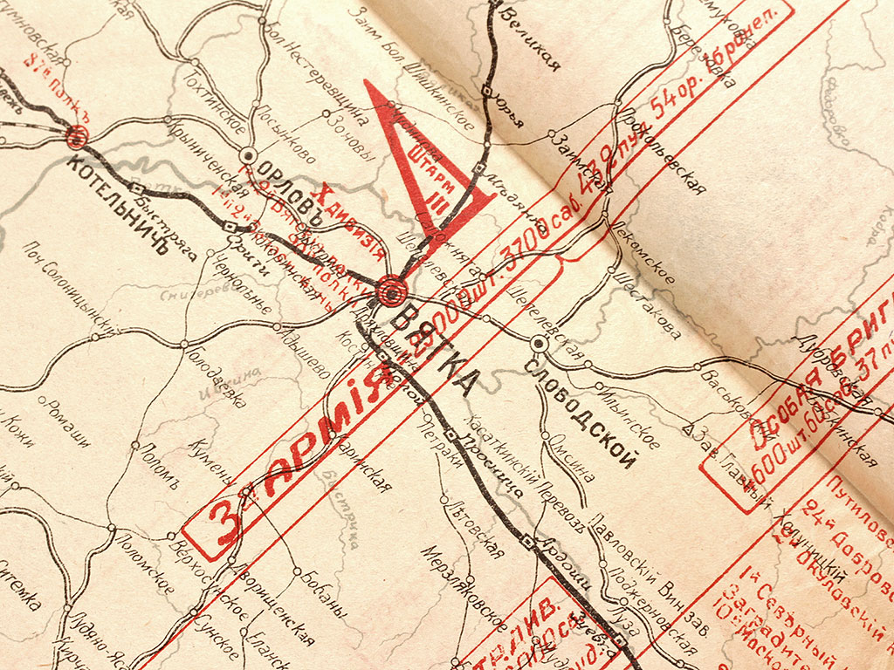
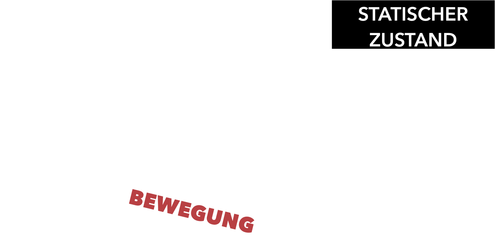

# »Mit dem roten Keil schlage die Weißen«

Das Plakat „Mit dem roten Keil schlage die Weißen“ (Original auf Russisch: „Клином красным бей белых“) von El Lissitzky aus dem Jahr 1920 ist ein Propagandaplakat für die Rote Armee zur Zeit der politischen Umstrukturierung und des Bürgerkriegs in Russland nach der Oktoberrevolution. Es entstand in Witebsk, damals Russland – heute Weißrussland – und hat seinen Titel von dem Schriftzug, welcher sich auf dem Plakat befindet, übernommen.

### Leitfaden
Der Leitfaden meiner Analyse ist der Aufsatz von Prof. Dr. Verena Krieger „El Lissitzkys "Roter Keil" - 4 Kontexte und 3 Bildlektüren. Die Semantik der Form in ikonologischer Perspektive“ (2015).  [&lbrack;1&rbrack;](#quellen) 

Darin stellt sie zu Beginn die Ausgangsfrage, warum dieses Werk von der Kunstgeschichte so wenig erforscht sei, und zeigt mit ihrer Untersuchung die Vielseitigkeit und Komplexität dieses Werks auf.

Ich baue meine Auseinandersetzung prinzipiell auf ihre Argumentation auf. Während sie jedoch versucht, die Komplexität des Plakats zu belegen, nehme ich diesen Fakt in meiner Analyse als gegeben an und beschäftige mich stattdessen mit der Frage nach der Dualität des „Roten Keils“, welche sich durch die verschiedenen Deutungen wie ein roter Faden zieht. 
 
 
Was damit gemeint ist, erkläre ich im Folgenden.

---

## Dualität von Krieg & Kunst

Lissitzkys „Roter Keil“ stellt auf vielen Ebenen einen Zustand der Ambivalenz und Dualität dar!

###### **Abb. 1:** Lissitzky, E. (1920). Mit dem roten Keil schlage die Weißen.

Sei es in der Komposition, welche sich konsequent in Form, Farbe und Kontrast einer Zweiteilung bedient, oder in der Darstellung der polarisierten Bevölkerung im Bürgerkrieg, die sich lediglich als eine fragmentierte Gesellschaft zwischen den Fronten begegnet. 

### Ausgangsfrage
Wie es die Ironie so will, ist auch das Werk selbst genau in der Position gelandet, die es abbildet – nämlich in einem Zustand der Zerrissenheit, jedoch in einem anderen Kontext, als man vielleicht annehmen mag. Gemeint ist der kunsthistorische Diskurs um das Werk, oder besser gesagt, der Mangel an diesem. Obwohl sich der „Rote Keil“, sowohl in der Erforschung politischer Plakatkunst als auch im kunsthistorischen Raum, einer durchaus großen Bekanntheit erfreut, sähe sich keine dieser Disziplinen so richtig für die Erforschung dieses Plakats zuständig, so Prof. Dr. Krieger. 

In der Propagandaforschung scheint das Fehlen einer gegenständlichen Ikonographie, welche sich im politischen Plakat nicht durchgesetzt hat, ein Ausschlusskriterium für einen potenziellen Forschungswert darzustellen. Gleichzeitig belächelt die Kunstgeschichte die offensichtliche Lesbarkeit der Aussage als einen Qualitätsmangel im künstlerischen Wert. Währenddessen findet sich der „Rote Keil“ erneut im Zentrum eines Konflikts, bei dem von beiden Parteien leider wieder einmal nur in Schwarz-Weiß gedacht wird.

Dabei ist gerade das Zusammenwirken von Abstraktion und Kommunikation – als Propagandaplakat und Kunstwerk – so spannend in der Fragestellung nach der Semantik der gegenstandslosen Formsprache und der Erforschung diverser kultureller und wahrnehmungspsychologischer Einflüsse.

### Mein roter Faden
Ich stellte mir die Frage, ob sich neben dem Offensichtlichen auch andere Formen der Dualität in den Deutungen finden lassen, was im Folgenden auch zum zentralen Punkt meiner Auseinandersetzung wird.

---

# Kultureller Kontext
Bevor ich in die tatsächliche Bildanalyse gehe, ist es wichtig, einen grundlegenden historischen, politischen und künstlerischen Kontext zu etablieren, sowohl zur russischen Gesellschaft zur damaligen Zeit als auch zu Lissitzky und seinem Werk. Dies ermöglicht es, die Zusammenhänge in den Deutungen besser nachzuvollziehen. 

### Russische Bevölkerung verstehen
Keine Kultur existiert ohne ihre Bevölkerung. Um die Kohärenz hinter den Propagandainstrumenten als Gesamtbild zu verstehen, sollte man zuerst die russische Mentalität und ihren gesellschaftlichen Kontext zumindest in Grundzügen erfassen. 

### Russland im Krieg
Der Bürgerkrieg in Russland von 1917 bis 1920 führte zu einer tiefen Spaltung der Bevölkerung. In dieser turbulenten Zeit standen sich die Bolschewiki (die Roten) und die Konterrevolutionären (die Weißen) in einem Bürgerkrieg gegenüber. Diese gesellschaftliche Fragmentierung machte das Land besonders anfällig für Radikalisierung durch Propaganda. Parallel dazu herrschte im April 1920 der Polnisch-Sowjetische Krieg, als Polen Russland angriff, um seine Ostgrenze zu verschieben. Aus polnischer Sicht ging es dabei um die Wiederherstellung der Grenzen Polens vor den Teilungen des 18. Jahrhunderts. Die Bolschewiki hingegen sahen in der polnischen Offensive eine Unterstützung der Weißen und eine zusätzliche Bedrohung für den jungen Sowjetstaat.

Während dieser Zeit nutzten die Bolschewiki Propaganda als wichtiges Instrument, um die Bevölkerung zu mobilisieren. Dazu instrumentalisierten sie ehemalige Ikonenmaler, professionelle Künstler aus dem Zarenregime sowie avantgardistische Künstler, die zuvor wenig Anerkennung gefunden hatten.

### Christlich-orthodoxe Prägung
Jedoch waren zuvor schon starke Einflüsse aus der orthodox-christlichen Kirche tief in der Mentalität Russlands verankert. Die orthodoxe Kirche und der Ikonenkult spielten dabei eine zentrale Rolle. Die orthodoxe Bildertheologie betrachtet Ikonen nicht als einfache Kunstwerke, sondern als Vermittler göttlicher Offenbarungen. Sie sind Ausdruck des Göttlichen und keine bloßen menschlichen Ideen. 

Das bedeutet, dass die Menschen bereits eine Bildsprache in ihrer Kultur praktiziert hatten, wodurch das Bild als solches in der Bevölkerung einen besonderen Stellenwert einnahm. Bilder wurden als spirituelle und metaphysische Fenster zu einer höheren Wirklichkeit angesehen. Diese besondere Bedeutung der Ikonen prägte die russische Bildkultur und verlieh ihr eine einzigartige Tiefe und Lebendigkeit. Ikonen dienten als wichtige religiöse und kulturelle Symbole, die das spirituelle Leben der Menschen bereicherten und fest in ihrem Alltag verankert waren.

### Analphabetische Bevölkerung
Der entscheidende Faktor war jedoch vermutlich, dass der Großteil der Bevölkerung analphabetisch und daher auf eine Symbolsprache in der nicht-verbalen Kommunikation angewiesen war, besonders nachdem die Mehrheitsbevölkerung nach dem ersten Weltkrieg einen tendenziell eher niedrigen Bildungsstand besaß. Dies wurde selbstverständlich von der Propaganda aufgegriffen, welche enorme Wirkung darin zeigte, das Volk in die politisch-militärische Positionierung zu involvieren.

---

## Wer war El Lissitzky?
El Lissitzky (* 22.11.1890, Potschinok; † 30.12.1941, Moskau), gebürtig Lasar Markowitsch Lissitzky, war ein russischer Avantgardist.
 

###### **Abb. 2:** Lissitzky, E. (1924). Der Konstrukteur (Selbstbildnis).

### Werdegang
1909 bis 1914 studierte er Architektur und Ingenieurwissenschaften an der Technischen Hochschule Darmstadt und hatte ab 1919 eine Professur an der Kunsthochschule in Witebsk, wo er mit anderen bedeutenden Künstlern dieser Zeit, z.B. Mark Chagall und Kasimir Malewitsch, zusammenarbeitete.

### Politische Arbeit
Sein Werk war schon immer stark kulturell und politisch geprägt. Bereits vor seiner Professur engagierte er sich in der russisch-jüdischen Kultur und illustrierte zahlreiche jüdische Bücher. Als überzeugter Kommunist sah er es als seine Verantwortung als Künstler, politische Ideen durch die Kunst zu verbreiten. Er war sehr aktiv in der künstlerisch-politischen Vereinigung UNOWIS, die an der Kunsthochschule Witebsk von Kasimir Malewitsch gegründet wurde.

### UNOWIS
Ursprünglich war UNOWIS eine Künstlergruppe an der Hochschule, hatte sich jedoch schnell sehr in die Verbreitung politischer Ideen involviert. Auch die Verbreitung der suprematistischen Bewegung war eins ihrer Ziele. Dabei gestaltete die Gruppe diverse Propagandaplakate, sowie Dekorationen für lokale politische und gesellschaftliche Events. 

###### **Abb. 3:** Nakov, A., & Malewitsch, K. (1920). Gruppe UNOWIS auf dem Weg nach Moskau zur Gesamtrussischen Konferenz der Kunstlehrer und -schüler.

###### **Abb. 3:** Ausschnitt – El Lissitzky.

###### **Abb. 4:** UNOWIS. (1920). Flugblatt Nr.1 des Witebsker „Tworkom“.

### Künstlerische Einordnung
Lissitzkys Werk wäre am ehesten in die russischen Avantgarde, den Konstruktivismus und den Suprematismus einzuordnen – alles abstrakte und gegenstandslose Kunstrichtungen, welche eng miteinander verwandt sind. Besonders der Suprematismus spielt eine wichtige Rolle in meiner Auseinandersetzung mit dem „Roten Keil“.

---

## Suprematismus
Der Suprematismus, welcher von Kasimir Malewitsch aus dem Futurismus heraus entwickelt wurde, erstreckte sich primär über den Zeitraum von 1913 bis 1930. 
 

###### **Abb. 5:** Malewitsch, K. (1916). Dynamischer Suprematismus. ML 1294 (links). **Abb. 6:** Lissitzky, E. (1920). Proun 1E – Die Stadt (rechts).

Diese Kunstrichtung ist konsequent gegenstandslos und stellt keine Abstraktionen von Menschen oder Gegenständen dar, sondern fokussiert sich ausschließlich auf die Darstellung von geometrischen Formen. Dieser folgt dem Prinzip der „gegenständlich-technischen Vollkommenheit“ in der Wissenschaft. Im Gegensatz zu anderen abstrakten Künstlern, z.B. Wassily Kandinsky, der eher expressionistisch arbeitete, zeichnet sich der Suprematismus durch einen sehr technischen und geometrischen Ansatz aus, der auf theoretischen Konzepten basiert.

El Lissitzky erweiterte den Suprematismus in seiner Interpretation um das Element der Räumlichkeit. Als gelernter Architekt nutzte er beispielsweise die isometrische Perspektive in seinen Kompositionen, welche typisch für Architekturzeichnungen sind.

Seine Arbeit hatte später Einfluss auf andere Kunstrichtungen, z. B. die holländische De Stijl-Bewegung und das Weimarer Bauhaus.

---

## Gegenstandslosigkeit
Ein zentrales Merkmal des Suprematismus ist die vollkommene Gegenstandslosigkeit, derer sich sowohl Malewitsch, als auch Lissitzky in ihren Werken bedienten. In Lissitzys suprematistischen Arbeiten lassen sich oft sowohl geometrische Formen, als auch typographische Elemente wiederfinden, so wie es auch im "Roten Keil" der Fall ist. Anhand seines Bilderbuches "Suprematische Erzählung von zwei Quadraten" wird außerdem deutlich, auf welche Weise er die gegenstandslosen Prinzipien des Suprematismus für seine Narration eingesetzt hat.

###### **Abb. 7:** Lissitzky, E. (1920). Suprematische Erzählung von zwei Quadraten in 6 Aufstellungen (Eigene Übersetzung ins Deutsche).

### Malewitschs Kunstauffassung
Jedoch bestand ein entscheidender, ideologischer Unterschied zwischen den beiden Künstlern in ihren Sichtweisen. Für Malewitsch hatte der Suprematismus eine metaphysische Dimension. Er sah in der utopischen „reinen Gegenstandslosigkeit“ einen idealen Zustand, den es zu erreichen galt. Seine suprematistischen Gestaltungen repräsentierten diesen Idealzustand, in dem Formen eine metaphysische Bedeutung hatten und eine höhere, abstrakte Realität darstellten.

### Lissitzkys Kunstauffassung
El Lissitzky hingegen verfolgte keine metaphysische Kunstauffassung. In seiner Arbeit mit den sogenannten "Prounen" (Projekt für die Befestigung des Neuen) sah er diese als eigenständige Dinge, die nicht nur Kunstwerke, sondern Modelle einer neuen Welt waren. Er nutzte die Gegenstandslosigkeit, um etwas Neues zu kreieren, anstatt das Bestehende abzubilden. Dies passte hervorragend zum politischen Umbruch der Zeit, in dem alte Strukturen zerstört und durch neue ersetzt werden sollten, wodurch sich die russische Avantgarde-Bewegung stark politisierte.

### Prounen
Lissitzky hatte das Ziel, die Form unter anderem für politische Zwecke zu semantisieren, also mit Bedeutung zu versehen. Im Gegensatz zu Malewitsch, der die Kunst als Ausdruck einer metaphysischen Utopie sah, nutzte Lissitzky die Kunst als Werkzeug zur Verbreitung politischer Ideen und zur Gestaltung einer neuen, revolutionären Gesellschaft. Seine Prounen (Akkronym für "Projekt für die Behauptung des Neuen" – Bezeichnung für Lissitzkys Werke) dienten als offene utopische Modelle, die den Wandel und die neue Welt symbolisierten, die durch die Revolution entstehen sollte. 

Der größte Unterschied liegt daher in Lissitzkys Ziel der Semantisierung der Form, auch für politische Zwecke, während Malewitsch eine metaphysische, idealistische Auffassung des Suprematismus verfolgte.

---

# Formsemantische Analyse
Für die Formsemantische Analyse werde ich zunächst mit der vor-ikonographischen Beschreibung anfangen und dann in eine Deutung übergehen.
 

###### **Abb. 1:** Eigene Bearbeitung – De- und Re-konstruktion des "Roten Keils".

Der „Rote Keil“ ist prinzipiell eine Komposition aus geometrischen Formen und Typografie. Es ist von einem Rahmen umgeben, der proportional zum Bildformat ist und aus einer dünnen schwarzen Linie besteht. Innerhalb des Rahmens teilt eine Diagonale mit einem Winkel von ca. 120° die Fläche in eine helle und eine dunkle Seite auf. Die helle Seite ist weiß, die dunkle Seite schwarz. Auf der schwarzen Seite befindet sich ein kreisförmiger Ausschnitt, der etwa die Hälfte der Höhe des Plakats einnimmt und sich im unteren rechten Quadranten innerhalb des Rahmens befindet. Die Diagonale schneidet den Kreis an zwei Punkten.

Leicht nach links versetzt im Zentrum befindet sich ein rotes, gleichschenkliges Dreieck, das etwas größer ist als der Durchmesser des Kreises. Die Spitze des Dreiecks überlappt den Kreis und endet ungefähr in der Mitte davon. Weiterhin befinden sich rechts oberhalb des großen Dreiecks mehrere kleinere rote Dreiecke. Direkt unter dem großen Dreieck befindet sich eine Raute, die aus zwei symmetrischen Dreiecken besteht, wobei das obere schwarz und das untere rot ist. Alle Dreiecke zeigen nach links.

Mittig unterhalb des großen Dreiecks und rechts davon befinden sich jeweils zwei Vierecke, die in einem schwarzen Punktraster gefüllt sind. Das untere kleine Viereck wird von der Raute in der Mitte durchkreuzt und steht parallel zur vertikalen Mittellinie links davon. Das obere große Viereck schneidet die schwarze Fläche in der rechten oberen Ecke und ist um ca. 45° geneigt. Es befindet sich genau rechts von der Mittellinie.

Innerhalb der schwarzen Fläche sind unterhalb und oberhalb des großen Kreises mehrere schmale, weiße Vierecke verteilt, die wie dicke Linien aussehen. In der linken unteren Ecke der schwarzen Fläche verlaufen diagonal angeordnete Linien, die nicht parallel zueinander sind. In der rechten oberen Ecke gibt es sechs Linien, von denen drei diagonal und drei horizontal verlaufen. Zusätzlich befindet sich dort ein Quader, der durch Schattierung mit einem schwarzen Punktraster dreidimensional wirkt. Weitere Linien in dieser Ecke sind abwechselnd beige, rot oder mit dem schwarzen Punktraster gefüllt und verlaufen horizontal und vertikal im 90°-Winkel zueinander. Ein kleiner heller Kreis ist das einzige runde Element in dieser Ecke, auf das eines der kleineren roten Dreiecke zeigt.

Auf der weißen Seite des Plakats befinden sich vier rote Vierecke, die ebenfalls wie Linien aussehen, sowie ein breiteres rotes Viereck, das vertikal ausgerichtet ist. Alle roten Elemente stehen im 90°-Winkel zueinander. Unter dem breiten roten Viereck verläuft eine Verbindungslinie, die eine Ecke des roten Vierecks mit der anderen verbindet. Diese Linie ist dünn und schwarz und verläuft gestrichelt.

Auf dem gesamten Plakat sind vier typografische Elemente verteilt, jeweils zwei auf der rechten und linken Seite, die zusammen den Schriftzug "Клином красным бей белых" (Russisch für "Mit dem roten Keil schlage die Weißen") bilden. Alle Wörter sind in Druckschrift und Versalien geschrieben. "Клином" steht links oben in Schwarz, "красным" steht unterhalb der horizontalen Mittellinie, etwas nach rechts versetzt und ist schwarz umrandet ohne Füllfarbe. "Бей" ist in Rot und steht rechts unten im großen Kreis. "Белых" steht innerhalb der schwarzen Fläche rechts unten, eingefasst in einem weißen rechteckigen Kästchen mit schwarzem Punktraster. Alle Wörter sind um ca. -30° geneigt, außer "белых", das um ca. -10° geneigt ist.

Das Plakat verwendet insgesamt drei Farben: Schwarz, Weiß und Rot. Weiß stellt dabei den Hintergrund dar.

---

<!--skipnav-->

### Akteure des Bürgerkriegs
Um bei den Farben zu bleiben, gehe ich zunächst auf die farblich zugeordnete Rollenverteilung ein. 

###### **Abb. 1:** Eigene Bearbeitung – Akteure nach Farben.

Dabei sind „die Roten“ die Hauptakteure, mit dem roten Keil als Protagonisten, während „die Weißen“ die gegnerischen Truppen darstellen. Schwarz wäre in diesem Kontext erst einmal nur das Terrain. 

Gleichzeitig kennzeichnen Schwarz und Weiß die beiden gegnerischen Fronten, welche im Kontrast zueinander gegenübergestellt werden, zwischen denen sich der rote Keil bewegt. Es wird ein Bild von zwei grundsätzlichen Gegensätzen gezeichnet, mit einer hellen, dominanten und einer dunklen, unterlegenen Seite, was durch die optisch größer wirkende weiße Fläche unterstrichen wird.

###### **Abb. 1:** Eigene Bearbeitung – Gegenüberstellung der gegnerischen Fronten.

---

<!--skipnav-->

### Machtverhältnisse
Betrachtet man den Kreis als eine Negativform anstatt einer weißen Fläche, kann man diesen als einen Leerraum interpretieren, in den der rote Keil ohne Widerstand eindringen kann. 

###### **Abb. 1:** Eigene Bearbeitung – Darstellung eines Machtverhältnisses.

Auch bei Betrachtung der beiden dominanten Diagonalen erkennt man eine Darstellung eines Machtverhältnisses: Die erste Diagonale ist der Verlauf des roten Keils, dessen Spitze direkt auf das Zentrum des Kreises zeigt, wie bei einer Zielscheibe, die von einem Pfeil direkt ins Schwarze getroffen wurde. 

Die zweite ist die Grenze des feindlichen Terrains, welche von dem roten Keil bereits überschritten wurde.

---

<!--skipnav-->

### Dominanz der Roten
Ähnliche Dynamiken zeigen sich in der Komposition der einzelnen Formelemente. 

###### **Abb. 1:** Eigene Bearbeitung – Dominanzdarstellung durch Formsprache.

Die Roten zeigen zielgerichtet auf den Gegner, während die Weißen nicht nur klein, sondern auch etwas zerstreut und defensiv an den Rand gedrängt werden. 

Auch die typografischen Elemente folgen dem gleichen Schema, bei welchem die Wörter „Mit dem roten Keil schlage“ die Dynamik und Bewegungsrichtung des roten Keils unterstützen und das Wort „die Weißen“ nicht nur in die Ecke, sondern dieses gänzlich aus dem weißen Kreis verdrängen.

###### **Abb. 1:** Eigene Bearbeitung – Dominanzdarstellung durch Typographie.

---

## Dualität der feindlichen Fronten

### Antithetisches Kampfbild
Aus einer rein formsemantischen Deutung heraus kann man das Motiv als ein antithetisches Kampfbild bezeichnen, das von einem Gut und Böse, Richtig und Falsch, Wir und die Anderen ausgeht. Ohne Zweifel wird eine eindeutige Darstellung des militärischen Konflikts zwischen den Weißen und den Roten abgebildet, welches ein Machtverhältnis der gegensätzlichen Fronten illustriert und dabei die Dominanz der Roten klar etabliert. 

Auch in der Komposition sowie in der Farb- und Formsprache wird eine klare Gegenüberstellung feindlicher Terrains ersichtlich, zwischen denen sich der Rote Keil als Protagonist und Hauptakteur bewegt.

### Oder mehr als das?
Doch steckt hinter dem „Roten Keil“ tatsächlich nur eine propagandistische Kampfansage, oder lässt sich eine tiefere Komplexität ergründen, die auf den ersten Blick nicht gleich ersichtlich ist?

---

# Visuelle Sprache
Semantisierung der Form bedeutet, dass Formen nicht nur als visuelle Elemente, sondern wie eine Art Syntax für eine lesbare Sprache verwendet werden. So sollte die abstrakte Darstellungsform von der Mehrheitsbevölkerung verstanden werden können, vor allem in einer Zeit des politischen Umbruchs.

Lissitzkys gegenstandslose Darstellungsweise nahm viel Inspiration aus bereits vorhandenen russischen Kulturelementen. Dadurch konnten die abstrakten Formen in einen Kontext gesetzt werden, der für die Bevölkerung nachvollziehbar war. Z. B. flossen Ikonen, Volkskunst und traditionelle Muster in die Arbeiten ein und schafften eine Verbindung zwischen der avantgardistischen Formensprache und der kulturellen Identität der russischen Bevölkerung.

---

<!--skipnav-->

### Parallelen zur russischen Volkskunst

###### **Abb. 8:** Unbekannt. (1869). Lubok – Abschied.

Lissitzkys Formsemantik weist deutliche Anklänge an die russische Volkskunst auf, beispielsweise an die verbreiteten Volksbilderbögen, die sogenannten Lubki. Diese einfachen Holzschnitte wurden per Hand mit flächenhaften Formen koloriert und zeichneten sich durch eine klare, abstrahierte Formensprache aus. Diese Art der Abstraktion und des flächigen Arbeitens findet sich auch in Lissitzkys Arbeit wieder, wobei diese traditionellen Techniken und Ästhetik in einen modernen, avantgardistischen Kontext übertragen wurden.

###### **Abb. 9:** Unbekannt. (1889). Traditionell besticktes Küchentuch.

Die geometrischen Formen, die in traditionellen russischen Mustern häufig vorkommen, waren ebenfalls ein Referenzpunkt. Diese Formen waren oft in Bestickungen von Textilien, Bemalungen von Geschirr und anderen Gegenständen zu finden. Durch die Einbindung dieser vertrauten Elemente konnte Lissitzky eine Verbindung zwischen der traditionellen Volkskunst und der modernen, abstrakten Kunst herstellen.

---

<!--skipnav-->

### Parallelen zur Ikonenkunst

###### **Abb. 10:** Unbekannt. (1400 – 1415). Der Thronende Heiland.

Auch zur russisch-orthodoxen Ikonenmalerei lassen sich Parallelen schlagen. Mittelalterliche Ikonen wirkten oft plakativ, weil wenige, unvermischte Farben für ihre Gestaltung verwendet wurden. Diese wurden nebeneinander gesetzt, um eine Polychromie zu erzeugen. 

In der traditionellen Ikonenmalerei spielen geometrische Formen wie Dreiecke, Kreise, Kreuze und Gitternetze außerdem eine zentrale Rolle. Diese Formsprache hat symbolischen Charakter und dient als Schlüssel zur ikonographischen und kompositorischen Dechiffrierung der Ikonen.

###### **Abb. 11:** Unbekannt. (1680). Russische Ikone, Gottesmutter Hodegetria von Tichwin.

###### **Abb. 10 + 11:** Eigene Bearbeitung – Geometrisch konstruierte Ikonenkompositionen.

---

<!--skipnav-->

### Parallelen zu militärischen Karten

###### **Abb. 12 – Ausschnitt 1:** Unbekannt. (1919). Schema der feindlichen Aufstellung an der Front der Truppen der Sibirischen Armee in Russland.

Ebenfalls lassen sich deutliche Parallelen zu militärischen Karten erkennen. Diese nutzen geometrische Formen, um strategische Positionen und Handlungen darzustellen. Diese Form der Darstellung funktionierte oft wie eine kartographische Ansicht aus der Vogelperspektive auf das Schlachtfeld. 

###### **Abb. 12 – Ausschnitt 2:** Unbekannt. (1919). Schema der feindlichen Aufstellung an der Front der Truppen der Sibirischen Armee in Russland.

###### **Abb. 12 – Ausschnitt 3:** Unbekannt. (1919). Schema der feindlichen Aufstellung an der Front der Truppen der Sibirischen Armee in Russland.

In einer Zeit, in der die Bevölkerung aufgrund der jahrelangen Kriegssituation mit solchen Darstellungen vertraut war, konnte man davon ausgehen, dass besagte Symbolik bei der Mehrheitsbevölkerung auf Verständnis traf.

---

<!--skipnav-->

### Farbsymbolik
Aus der Perspektive der Farbsymbolik wird besonders die Farbe Rot wichtig, z. B. in der russischen Ikonenmalerei, Volkskunst und politischen Symbolik.
 

###### **Abb. 13:** Kustodjew, B. (1919). Der Bolschewik.

Das russische Wort für Rot, "krasnyj", teilt denselben Wortstamm wie das Wort für Schön, "krasivyj", was eine positive Assoziation der Farbe Rot in der russischen Kultur widerspiegelt. In der Tradition war die "Rote Ecke" in russischen Wohnungen der Ort, an dem Ikonen aufgestellt werden.

###### **Abb. 14:** Unbekannt. (E.14.Jh.). Ikone: Prophet Elias.

###### **Abb. 15:** Unbekannt. (E.14.Jh.). Ikone: Heiliger Georg.

Seit den 1870er Jahren war Rot auch die Farbe der sozialistischen Bewegung und später der Signalfarbe der Roten Armee. Diese Farbe steht für Revolution und wurde von den Bolschewiki als Symbol ihrer Ideologie verwendet.

---

<!--skipnav-->

### Der Archetyp des roten Keils

###### **Abb. 16:** Kolli, N. D. (1918). Denkmal „Roter Keil“ – Skizze.

Der rote Keil wurde bereits vor Lissitzkys Plakat von der sowjetischen Bewegung als ein Symbol der Revolution verstanden, so tauchte die Metapher des roten Keils schon während der Oktoberrevolution auf. Z. B. Verwendete der Revolutionär Lew Trotzki den Ausdruck „Keil der Revolution“ in seinen politischen Reden und auch existierte ein Jahr nach der Revolution ein vorübergehendes Denkmal mit dem Titel „Roter Keil“, welches Ähnlichkeiten zu Lissitzkys Komposition aufwies. 

###### **Abb. 17:** Unbekannt. (1918). Nikolai Kollis Denkmal „Roter Keil“ auf dem Platz der Revolution, Moskau.

###### **Abb. 18:** Dinitz, M. (2024). Foto eines Sovietstern Ansteckers aus 1964.

Auch sei anzumerken, dass die Motive von Lissitzkys „Roten Keil“ eng mit der Entstehung der frühen sowjetischen Symbolik verbunden sind. Die Bolschewiki wählten das Emblem des roten Sterns als erstes Symbol aus, um Russland auf der internationalen Bühne zu positionieren. Dieses Emblem besteht aus fünf von der Mitte ausgerichteten Dreiecken, wodurch der Keil als ein Element des Sterns eine zusätzliche Bedeutung erhält.

---

## Dualität von Tradition & Innovation

### Alt oder Neu?
Unter all diesen Aspekten stellt sich die Frage, inwiefern sich das suprematistische Prinzip der Abgrenzung von Altbekanntem mit der Verwendung so vieler traditioneller Referenzen vereinbaren ließ? Laut Lissitzky steht die Erschaffung des Neuen unter der Verwendung altbekannter Symbolik keineswegs im Konflikt zueinander.

### Why not both!
Er strebte danach, eine klare und universell verständliche Bildsprache zu entwickeln, die auf einfachen Formen und archetypischen Symbolen basiert. Diese sollten eine direkte Kommunikation mit der Mehrheitsbevölkerung ermöglichen, unabhängig von deren Bildungsstand. Dabei transformierte er vertraute Formen in moderne Ausdrucksformen, ohne bloße Abbildungen zu schaffen.

---

# Wahrnehmungspsychologische Analyse
Der Fokus der wahrnehmungspsychologischen Analyse liegt darauf, bestimmte Elemente des Plakats den Maßstäben zeitgenössischer Experten zu Lissitzkys Lebenszeiten in ihrer psychologischen und unterbewussten Wirkung auf den Betrachter zu untersuchen.

---

<!--skipnav-->

### Nach Arnheim
Rudolf Arnheim (* 15. Juli 1904, Berlin; † 9. Juni 2007, Ann Arbor, Michigan) war ein  deutsch-US-amerikanischer Medienwissenschaftler und Kunstpsychologe.

###### **Abb. 1:** Eigene Bearbeitung – Verhältnis von Keil und Kreis.

###### **Abb. 19:** Unbekannt. (1950s). Rudolf Arnheim performing a class at the Sarah Lawrence College in Bronxville.

Arnheim betont, dass Bildelemente in einem "Kräftespiel" stehen, wobei die Schrägheit von Formen Dynamik ausdrückt. Auf diesem Plakat existieren der Keil und der Kreis in einem solchen Kräftespiel. Die schräg gestellte Keilform sorgt für eine aktive Dynamik. Seine schräge Anordnung und Form erzeugen eine Bewegungsrichtung, die von der Normalität (gerade, frontale Linien) abweicht und so Dynamik und Aggressivität vermittelt. 

Der Kreis bildet das passive Element im Bild, das durch den Keil attackiert wird. Das Verhältnis von Keil und Kreis erzeugt eine bipolare Konstellation. Der Kontrast entsteht durch die Begegnung der beiden Partner, getrennt und im Gleichgewicht gehalten durch eine imaginäre Mittelachse. Diese innere Spannung resultiert aus dem Gegensatz der beiden Formen, wobei der Keil als aggressives, eindringendes Element wahrgenommen wird und der Kreis als ruhiges, passives Ziel.

---

<!--skipnav-->

### Nach Kandinsky
Wassily Kandinsky (16. Dezember 1866, Moskau; † 13. Dezember 1944, Neuilly-sur-Seine, Frankreich) war ein russischer Maler, Grafiker und Kunsttheoretiker.

###### **Abb. 1:** Eigene Bearbeitung – Dynamik der Diagonalen.

###### **Abb. 20:** Erfurth, H. (1920). Porträt Wassily Kandinsky.

Kandinsky untersuchte die Empfindungswerte der Diagonalen und deren Wirkung auf die Betrachter. Die dramatische Spannung wird durch die Diagonale des Keils erzeugt. Diese Diagonale repräsentiert den höchsten Gegensatz und verstärkt die aggressive und kämpferische Stimmung des Plakats. Der Kreis bietet einen milden Gegensatz zur scharfen Diagonalen des Keils, was die Spannung zwischen den beiden Formen intensiviert.

---

<!--skipnav-->

### Nach Wölfflin
Heinrich Wölfflin (* 21. Juni 1864, Winterthur; † 19. Juli 1945, Zürich) war ein Schweizer Kunsthistoriker.

###### **Abb. 1:** Eigene Bearbeitung – Leserichtung.

###### **Abb. 21:** Wasow, E. (1924). Porträt Heinrich Wölfflin.

Wölfflins Beobachtungen zur Bildwahrnehmung und den Stimmungswerten der Bildhälften sowie den Diagonalen bieten weitere Einblicke in die Wirkung des Plakats. Die Leserichtung von links nach rechts beeinflusst die Wahrnehmung des Bildes. Eine Links-rechts-Diagonale wird als steigend empfunden, was die Dynamik und den Vorwärtsdrang des roten Keils verstärkt. 

Der linke Bereich des Bildes, der den Angriff des Keils darstellt, wird als der Beginn einer Aktion wahrgenommen, während der rechte Bereich, das Eindringen des Keils in den Kreis, als das Ziel oder das "letzte Wort" gilt. Dies verstärkt die narrative Kraft des Plakats.

---

## Dualität von Kampf & Sieg

### Dynamische Bewegung
Wie die Wahrnehmungspsychologie richtig erkannt hat, werden im „Roten Keil“ ohne Zweifel Machtverhältnisse, dynamische Diagonalen, sowie ein Zustand der Bewegung dargestellt.

### Statischer Zustand
Bei der Betrachtung des Gesamtbildes jedoch wird deutlich, dass es nicht nur eine Darstellung des Kampfes und der dynamischen Bewegung ist, sondern auch einen bereits geschehenen Siegeszustand statisch festhält. Die roten geometrischen Formen, insbesondere das große, gleichschenklige Dreieck, durchdringen die weiße Fläche, was darauf hinweist, dass die Roten bereits in das Territorium der Weißen eingedrungen sind. Diese Darstellung suggeriert eine Umstellung und Verdrängung der Weißen, was den Eindruck eines bereits erfolgten Sieges verstärkt. Somit wird nicht nur die aktuelle Kampfsituation gezeigt, sondern auch ein Moment festgehalten, in dem die Roten bereits dominieren und triumphiert haben.

So scheint Lissitzky, je nach Interpretation des Betrachters, gleichzeitig eine Realität – nämlich eine Kampfszene im Krieg – und eine Utopie – nämlich einen bereits errungenen Sieg – zu beschreiben.

---

# Fazit

## Vielen Dank!

In meinem Fazit reflektiere ich noch einmal die Dualitäten, die sich in meiner Auseinandersetzung ergeben haben: Das Plakat bewegt sich irgendwo zwischen Propaganda und Kunst, wie man durch die Ausgangsfrage und die Formsemantik erkennen konnte. Durch die Analyse der kulturellen Kontexte, die diese Formsprache für die Bevölkerung so zugänglich gemacht hat, konnten der Balanceakt zwischen dem Altbekannten und der Kreation des Neuen beobacht werden. In der Wahrnehmungspsychologie wurde deutlich, dass das Bild gleichzeitig eine Utopie des Sieges und eine Realität des Kampfes beschreibt.

Wenn man das alles hier als Gesamtbild betrachtet, erkennt man eindeutig die Komplexität, welche von Dr. Krieger beschrieben wird. Doch wie bereits etabliert wurde, ist es die Bipolarität, die für Spannung verantwortlich ist und diese Ansammlung an Dualitäten verleiht dem „Roten Keil“ seine Vollkommenheit.

---

## Quellen

**Scrollen für Literaturverzeichnis und Bildnachweise!**
 
 
[Hier klicken](#start), um zum Anfang zu springen!
 
 
[Zurück zur Übersicht](https://uclab.fh-potsdam.de/bildargument/)

### Credits
Text & Gestaltung: **Maria Dinitz**  
Betreuung: **Dr. Sabine de Günther**  
Kurs: **Argumentation im Bild und über das Bild: Europäische Bild- und Kleidergeschichte visualisiert**   
Sommersemester 2024  
Fachhochschule Potsdam  

---

 
 

[Contact](mailto:marian.doerk@fh-potsdam.de,philipp.proff@gmx.de?subject=Syllabus%20Site) · [Imprint](https://www.fh-potsdam.de/impressum) · *This is a [Syllabus Site](https://infovis.fh-potsdam.de/syllabus-site/)*
